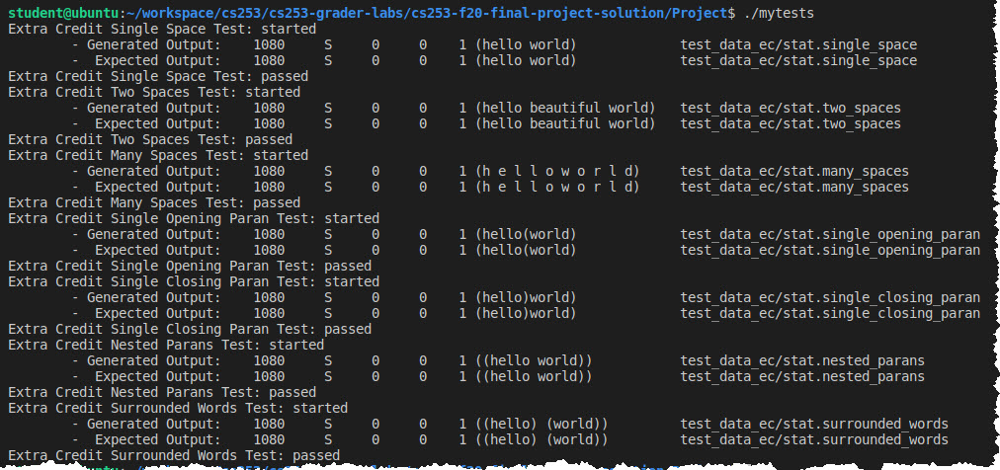

# Test cases and data for extra credit
##  Procedure
Please extract the [test_data_ec.tgz](test_data_ec.tgz) into your project directory and then run the test cases provided in [mytests.c](mytests.c) against your project implementation.  I developed these 7 test cases while testing my own implementation and I will use them to evaluate the correctness of your implementation. Each test displays **passed** if it is able to execute without runtime errors, however you will need to visually compare the output generated by your implementation against the expected output to confirm correctness.

